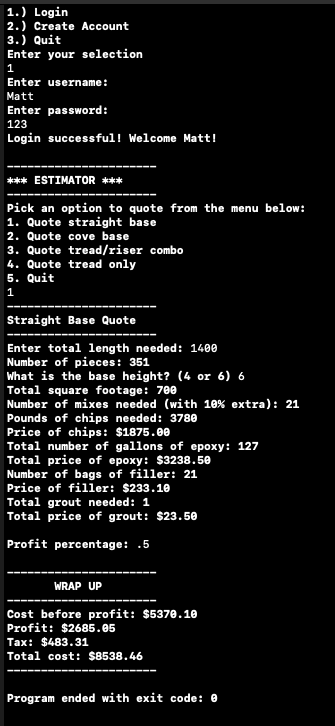
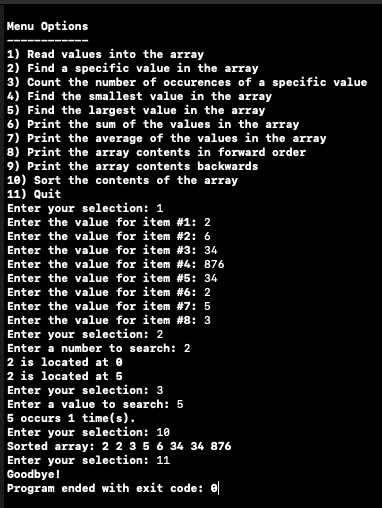

## Hi, Matt Wheatley.
Feel free to check back to view my projects 
Download resume 
<a href="https://github.com/wheatthin34/wheatthin34.github.io/blob/master/MatthewWheatleyResume.pdf" target="_blank">here.</a>

  
        <a href="#aboutMe">About Me</a>&nbsp;&nbsp;
        <a href="#careerobjective">Career Objective</a>&nbsp;&nbsp;
        <a href="#selfassessment">Self Assessment</a>&nbsp;&nbsp;
        <a href="#education">Education</a>&nbsp;&nbsp;
        <a href="#skills">Skills</a>&nbsp;&nbsp;
        <a href="#codereview">Code Review</a>&nbsp;&nbsp;
        <a href="#projects">Projects</a>&nbsp;&nbsp;
        <a href="#contact">Contact</a>
   
 
 
<h3 id="aboutMe"><strong>About Me</strong></h3>

&nbsp;&nbsp;&nbsp;&nbsp;My name is Matt Wheatley and I am from Louisville, Kentucky. I will be graduating with a Bachelors degree in Computer Science from Southern New Hampshire University at the end of 2019.
 
 

 <h3 id="careerobjective"><strong>Career Objective</strong></h3>

&nbsp;&nbsp;&nbsp;&nbsp;Seeking a position in an environment that will help me to grow and learn while gaining hands on
experience in the software development process.
 
 

 <h3 id="selfassessment"><strong>Self Assessment</strong></h3>

&nbsp;&nbsp;&nbsp;&nbsp;Over the past few years I have learned a lot about computer science and the many fields that fall under the computer science category and I am excited to learn more as I transition into my career. Computer science was a new topic to me compared to many other students that I had taken courses with. When I first got into the program, I found that a lot of my classmates were either already working in the field or have been writing code for many years which caused me to feel a little overwhelmed and behind. I believe that this helped me to push harder in my courses and I am proud of how well my hard work payed off. I do believe that I still have a lot learn and I am excited to learn from others in the profession.  
&nbsp;&nbsp;&nbsp;&nbsp;My first few courses consisted of learning about different programming languages and I was instantly hooked. These courses helped me have a better understanding of software engineering and databases. I found myself learning different ways of thinking and how to create programs more efficiently and effectively It also taught me basic coding practices like commenting code, naming variables, proper control flow. I then began with data structures and algorithms which was a bit of a struggle but with continued practice I began to have a better understanding. We covered a lot in this course like arrays, linked lists, trees, queues, stacks and more. This transitioned into different algorithms like sorting and searching through data structures. Secure coding was very interesting, and I feel like I still have a lot to learn. It is amazing the different ways users can exploit programs intentionally and unintentionally. I enjoyed having hands on experience trying these different methods like buffer overflows, SQL injections and more. Many of these can be avoided with simple coding practices. 
&nbsp;&nbsp;&nbsp;&nbsp;Some of my courses also consisted of the business side of computer science which was very beneficial to me. I did not have much of an idea of how people worked in this field. At least from a day to day basis. It was interesting learning about working in a team environment and using Git to help the team stay organized and keeping track of any changes made. I also found it interesting in the different types of design processes like the agile and waterfall method along with the pros and cons of each method.  
&nbsp;&nbsp;&nbsp;&nbsp;Below are two <a href="#projects">projects</a> that show some of my personal projects that help display my understanding of different computer science subjects. The first project is an estimating tool that I am able to use at my current work to help price out projects faster than our traditional method. It allows the user to enter in a few basic details about the item and outputs costs of the total project and different materials included in the project. The next project is a personal project I was working on to get a better understanding or arrays along with different searching and sorting algorithms. 

 
 

 <h3 id="education"><strong>Education</strong></h3>

<strong>Southern New Hampshire University</strong> 
Bachelor of Science in Computer Science  
Concentration in Software Engineering 
December 2019
 
 

 <h3 id="skills"><strong>Skills:</strong></h3>

  C++
 - Python
 - Java
 - Swift
 - SQL
 - MongoDB
 - Reverse Engineering
 - Git
 - SDLC
 

 <h3 id="codereview"><strong>Code Review</strong></h3>

<iframe width="560" height="315" src="https://www.youtube.com/embed/VlGciz_-5ls" frameborder="0" allow="accelerometer; autoplay; encrypted-media; gyroscope; picture-in-picture" allowfullscreen></iframe>

 

 <h3 id="projects"><strong>Projects</strong></h3>

<strong>Estimating Tool: </strong><a target="_blank" href="https://github.com/wheatthin34/Estimator">View Project</a>  
&nbsp;&nbsp;&nbsp;&nbsp;This project will begin with having the user create a username and password. If they already have an account, they will be able to login using their information. This will be a program that I will be able to use at my current job to help make estimating projects easier. The program will only require the user to enter in a little bit of information and will calculate the pricing and amount of materials needed for a job.  
&nbsp;&nbsp;&nbsp;&nbsp;I chose to create this program to show that I can start from scratch and create something functional that I can use every day. I believe that this artifact will show that I have a pretty good skill set in coding practices. It will show that I know a wide array or good coding practices like properly naming and assigning variables, commenting, using proper control flow, and secure coding. I still have more functionality to add to this program and comments to add but it is starting to take shape.  
&nbsp;&nbsp;&nbsp;&nbsp;I believe that this project will meet the course objectives with this project. This will show that I have a good understanding of software design process and how databases work. Understanding the software design process will play a big part in my computer science career. I would like to be a programmer when I move into this field so this will help display that I have and understanding of this topic. The process has been a little more challenging than I thought it would be. I thought I would be able to jump right in and start coding without thoroughly thinking about how I was going to put it together. I learned that I needed to take a step back and create a basic layout or pseudocode of some sort to help in the coding process. I am finding that I am having to create more functions than I thought I would have and having to spend more time thinking about these other functions. I also have not had experience with connecting a database to C++. It has taken some research to figure out a good method. Right now, the database is being saved in a document and the code searches the .txt file for the login information. 
  
  
 <strong>Estimating Tool Screenshot:</strong> 
 

  

 <strong>Arrays: </strong> <a target="_blank" href="https://github.com/wheatthin34/Arrays">View Project</a>  
&nbsp;&nbsp;&nbsp;&nbsp;This program allows the user to enter eight numbers into an array and perform different tasks with the array. Some of the functions include to print the array forwards and backwards, print the sum and print the average. This was a program that I created a few months ago to mess around and get a better understanding of arrays in C++. 
&nbsp;&nbsp;&nbsp;&nbsp;I chose to include this project to show that I can start from scratch and show how my programming is organized. I plan on improving this program by including different types of search and sort functions. The search functions I plan to include involve searching for a specific value, count the number of occurrences, and search for the lowest and highest value. I also plan on including a sort function that will sort the values in the array. Including multiple algorithms and data structures will help display to potential employers that I have a good understanding of these subjects.  
&nbsp;&nbsp;&nbsp;&nbsp;I believe that this project will meet the course objectives with this project. This will show that I have a good understanding of algorithms and data structures. Understanding algorithms and data structures will be a big part in my future computer science career. The process was a little more challenging than I thought it would be. Making sure that the search and sort functionality worked correctly took plenty or testing and debugging. I have not had much experience in sorting and searching which made this whole project a learning experience. 
  
  
 <strong>Arrays Screenshot:</strong> 
 

  <h3 id="contact"><strong>Contact</strong></h3>

matt.d.wheatley@gmail.com
 <a target="_blank" href="https://github.com/wheatthin34">GitHub</a>
